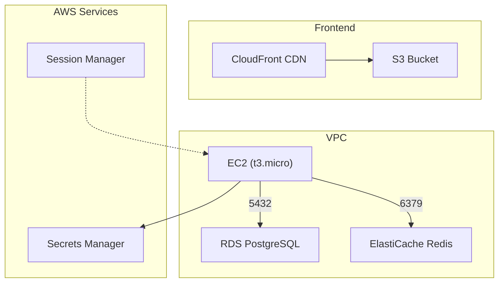

# Terraform Infrastructure

## Architecture



## Directory Structure

```
aws/
├── modules/
│   ├── compute/     # EC2 instance
│   ├── data/        # RDS + ElastiCache
│   ├── frontend/    # S3 + CloudFront
│   └── security/    # IAM, security groups
└── environments/
    └── prod/
        └── scripts/deploy.sh
```

## Terraform Commands

From `aws/environments/prod/`:

### Init

```bash
cd aws/environments/prod
terraform init
```

### Start / Apply

```bash
terraform apply
```

### Update (after code changes)

```bash
terraform plan    # Preview changes
terraform apply   # Apply changes
```

### Stop / Destroy

```bash
terraform destroy
```

### View Outputs

```bash
terraform output
```

### Deploy Frontend

```bash
./scripts/deploy.sh
```

## Debugging Commands (SSM)

### EC2 - Connection

```bash
aws ssm start-session --target $(terraform output -raw instance_id) --region us-east-2
```

### PostgreSQL - List Tables

```bash
source ~/production/server/.env
PGPASSWORD="$DB_PASSWORD" psql -h "$DB_HOST" -U postgres -d capital -c "\dt"
```

**Expected output:**

```
               List of relations
 Schema |       Name        | Type  |  Owner   
--------+-------------------+-------+----------
 public | accounts          | table | postgres
 public | budget_categories | table | postgres
 public | budgets           | table | postgres
 public | economy           | table | postgres
 public | transactions      | table | postgres
 public | users             | table | postgres
(6 rows)
```

### Redis - List All Keys

```bash
source ~/production/server/.env
redis-cli -h ${REDIS_URL%:*} -p ${REDIS_URL#*:} KEYS "*"
```

**Expected output:** `(empty array)` when no session data

### Check API

```bash
curl http://$(terraform output -raw instance_public_ip)/api/v1
```

### Check User-Data Logs

```bash
tail -f /var/log/user-data-build.log
```
