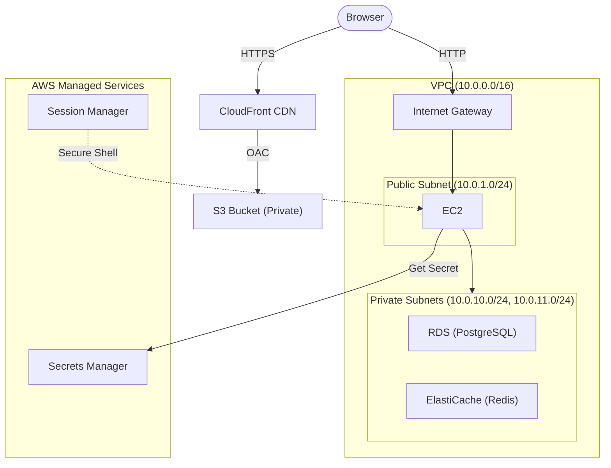
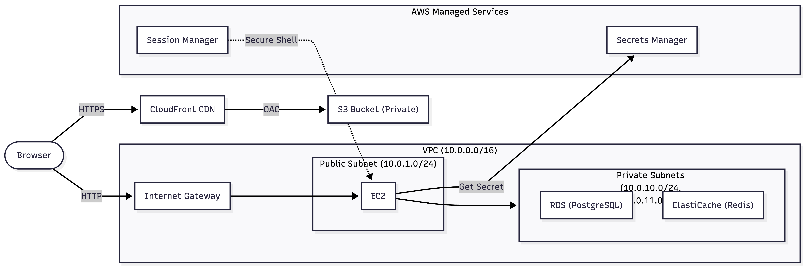

# Capital AWS Infrastructure

## Architecture Overview

**https://mermaid.live/edit**





## Prerequisites

- Terraform >= 1.0
- AWS CLI configured with appropriate credentials
- Secrets Manager secrets created at `prod/capital/*` corresponding to key-value pairs found in `/server/.env`

## Project Structure

```
aws/
├── modules/
│   ├── networking/    # VPC, subnets, internet gateway, route tables
│   ├── compute/       # EC2 instance with SSM access
│   ├── data/          # RDS PostgreSQL, ElastiCache Redis
│   ├── frontend/      # S3 bucket, CloudFront distribution
│   └── security/      # IAM roles, security groups
└── environments/
    └── prod/
        ├── main.tf
        ├── variables.tf
        ├── outputs.tf
        └── scripts/deploy.sh
```

## Usage

All commands run from `aws/environments/prod/`:

```bash
$ cd aws/environments/prod
```

### Initialize

```bash
$ terraform init
```

### Deploy

```bash
$ terraform apply
```

**Expected output:**

```
Apply complete! Resources: 33 added, 0 changed, 0 destroyed.

Outputs:

ami_id = "ami-xxxxxxxxxxxxxxxxx"
cloudfront_distribution_id = "XXXXXXXXXXXXXX"
cloudfront_domain = "xxxxxxxxxx.cloudfront.net"
cloudfront_url = "http://xxxxxxxxxx.cloudfront.net"
iam_role_arn = "arn:aws:iam::xxxxxxxxxxxx:role/capital-ec2-ssm-role"
instance_id = "i-xxxxxxxxxxxxxxxxx"
instance_public_ip = "x.x.x.x"
rds_endpoint = "capital-postgres.xxxxxxxxxx.us-east-2.rds.amazonaws.com"
redis_url = "capital-redis.xxxxxx.xxxx.use2.cache.amazonaws.com:6379"
s3_bucket_name = "capital-frontend-xxxxxxxxxxxx"
ssm_connect_command = "aws ssm start-session --target i-xxxxxxxxxxxxxxxxx --region us-east-2"
```

### Format & Validate

```bash
$ terraform fmt -recursive && terraform validate
```

### Update

```bash
$ terraform plan     # Preview changes
$ terraform apply    # Apply changes
```

### Destroy

```bash
$ terraform destroy
```

### View Outputs

```bash
$ terraform output
```

## Operations

### Connect to EC2 via SSM

```bash
$ aws ssm start-session --target $(terraform output -raw instance_id) --region us-east-2
```

The following commands run from within the EC2 instance after connecting via SSM:

### Database Access

```bash
$ source ~/production/server/.env
$ PGPASSWORD="$DB_PASSWORD" psql -h "$DB_HOST" -U postgres -d capital -c "\dt"
```

### Redis Access

```bash
$ source ~/production/server/.env
$ redis-cli -h ${REDIS_URL%:*} -p ${REDIS_URL#*:} KEYS "*"
```

### View Bootstrap Logs

```bash
$ tail -f /var/log/user-data-build.log
```

The following commands run locally:

### Health Check

```bash
$ curl http://$(terraform output -raw instance_public_ip)/api/v1
```

## Security Notes

- EC2 is accessible via SSM Session Manager only (no SSH keys)
- RDS and ElastiCache are deployed to private subnets
- S3 bucket is private with CloudFront OAC access only
- Secrets are stored in AWS Secrets Manager

### IAM Policy Scoping

The Terraform user policy (`modules/security/policies/iam-policy.json`) enforces least-privilege access through resource-level restrictions:

| Service | Scope | Method |
|---------|-------|--------|
| **IAM** | `capital-*` roles/profiles | ARN pattern matching |
| **RDS** | `capital-*` instances/subnet groups | ARN pattern matching |
| **ElastiCache** | `capital-*` clusters/subnet groups | ARN pattern matching |
| **S3** | `capital-*` buckets | ARN pattern matching |
| **Secrets Manager** | `prod/capital/*` secrets | ARN path prefix |
| **EC2** | `Project=capital` tagged resources | Tag-based conditions |
| **CloudFront** | `Project=capital` tagged distributions | Tag-based conditions |

Exceptions requiring `*` resources:

- EC2/CloudFront `Describe/List` actions (AWS limitation)
- CloudFront Origin Access Controls (no resource-level support)
